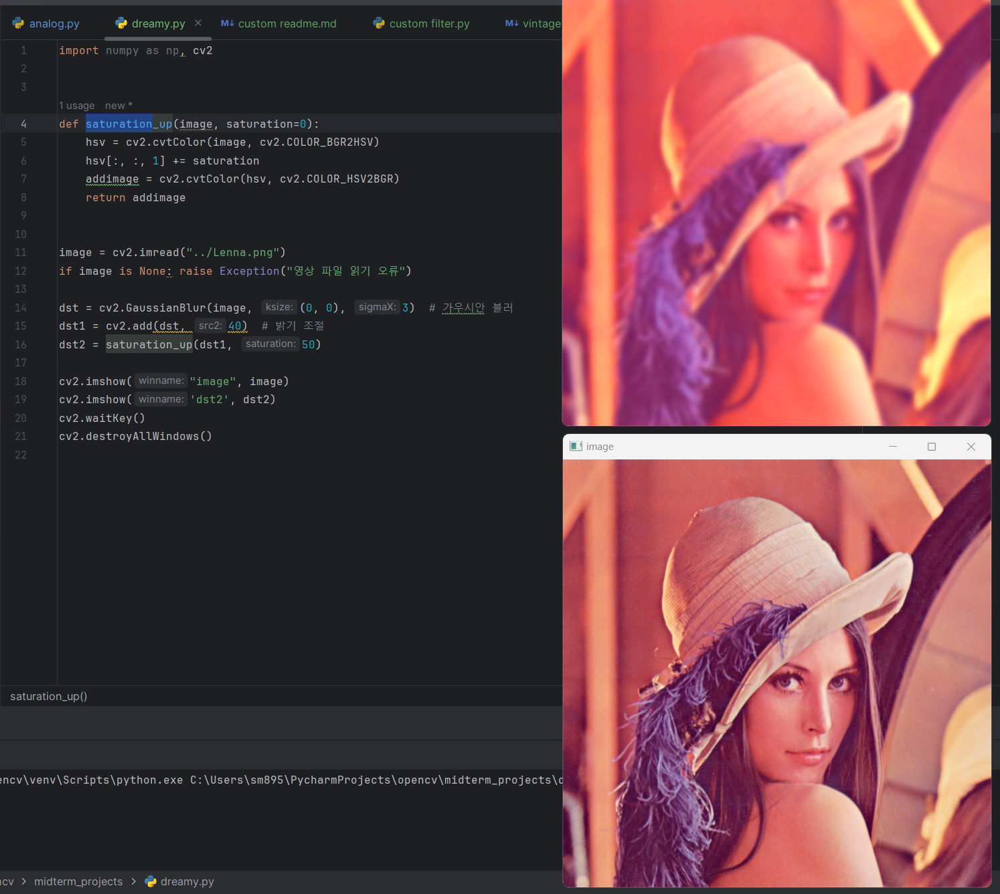

import numpy as np, cv2

# 채도의 값을 증가시켜주는 saturation_up를 정의한다

def saturation_up(image, saturation=0):
hsv = cv2.cvtColor(image, cv2.COLOR_BGR2HSV)
hsv[:,:,1] += saturation
addimage = cv2.cvtColor(hsv, cv2.COLOR_HSV2BGR)
return addimage

image = cv2.imread("../Lenna.png")
if image is None: raise Exception("영상 파일 읽기 오류")

# 가우시안 블러를 image에 적용한걸 dst에 저장

dst = cv2.GaussianBlur(image, (0,0), 3)

# dst에 밝기 값을 증가시켜 dst1에 저장

dst1 = cv2.add(dst1,40)

# dst1에 위에 정의 해놓은 saturation_up를 이용하여 채도를 높이고 dst2에 저장

dst2 = saturation_up(dst2, 50)

cv2.imshow("image", image)
cv2.imshow('dst2', dst2)
cv2.waitKey()
cv2.destroyAllWindows()